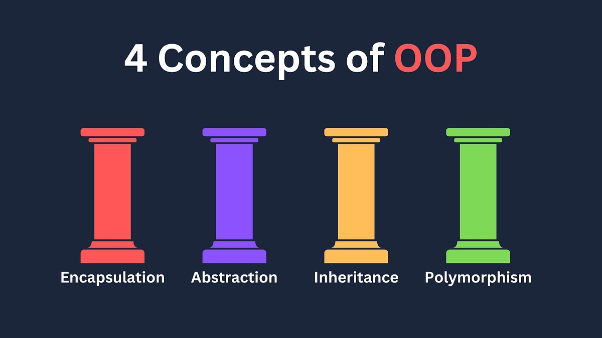

# Counter.js — OOP JavaScript Documentation Site

A documentation and live demo site for a stateful `Counter` class and its 
`StepCounter` subclass, built with vanilla JavaScript using OOP principles, 
ES Modules, and GSAP animations.

---

## Project Overview

This project demonstrates object-oriented JavaScript through a reusable 
`Counter` component. Each counter instance manages its own state and DOM 
rendering independently, making it easy to place multiple counters on a 
single page without conflicts.

A `StepCounter` subclass extends the base class to support custom increment 
and decrement step values via inheritance.

---

## Features

- Encapsulated counter state using ES6 classes
- Inheritance — `StepCounter` extends `Counter`
- Multiple independent counter instances on one page
- Buttons disable visually when the counter hits its minimum
- Smooth GSAP entrance animations on hero and scroll sections
- Responsive grid layout
- ES Module structure (`import` / `export`)
---

## 👨‍💻 Credits

**Author**: Ajay Chakaravarthy Antony Raj
